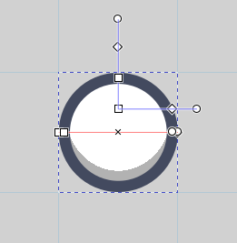
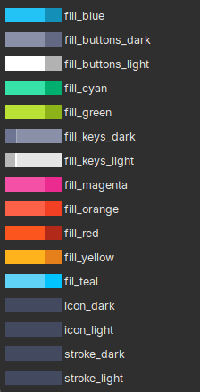

   

 <b>Mr. Breakfast's Free Prompts</b> is an input prompt pack with over 400 svg and png assets 
  
 
  

 

---

  
<b>🍬 Previews</b>

 
   
   
   
   
   
   

---

Inspired by the look and freedom of [Kenney](https://kenney.nl/assets/input-prompts-pixel-16) and the freedom of [Xelu's](https://thoseawesomeguys.com/prompts/) free prompts.

Remix the source here, or download and support the pack on [Itch.io](https://mrbreakfastsdelight.itch.io/mr-breakfasts-free-prompts)

### 🛋️ Supports:
- Nintendo Switch
- Xbox Series
- PlayStation™ 5
- Steam Deck
- Generic game pad
- Keyboard and mouse

### 🖌️ How is the Source made?
The source was designed in [Inkscape](https://inkscape.org/). Every prompt has a gradient for the fill, stroke, and inner icon. Think of this like a color variable. The gradients are locked and globally shared between assets, allowing for easy edits of the dark and light color schemes.

Here's an example of a generic light button:

And the gradients included so far:

Many of the triggers/bumpers were created using Inkscape's `Corner` live path effect. The keyboard keys have a different fill gradient from the other prompts.

### ♻️ Contributing Guide

You will need to install the following:

1. [Inkscape](https://inkscape.org/) (version 1.3 or greater recommended)
2. [Poppins font](https://fonts.google.com/specimen/Poppins)

If you intend to submit a pull request, please organize your work under the correct layers, and make sure your paths are properly grouped and named.

Groups begin with the vender name `xbox`, then the name of the button `y`, and then whatever other attributes apply. `color` if it's a colored button, and `dark` or `light` depending on the scheme it follows:

> `vender_title_tags`
> 
> Example: `xbox_y_color_dark`

#### Exporting Changes
After you've made your changes to the `inputs.svg` source file, you'll need to update the corresponding files.  

Let's begin with exporting the individual SVG files as this has the most steps:
1. Make a temporary duplicate of `inputs.svg`, and navigate to that file
2. Click 'Select All in All Layers' to select all the individual prompts
3. Navigate to the 'Path' menu and click 'Object to Path' or use `Shift+Control+C`
4. Using batch export, ensure the background color is transparent, format is Plain SVG, overwrite is enabled, and that there is no prefix appended to the file name. Export to `~/svg`

The individual PNGs are done similarly. Select all, and export the prompts at 96DPI to `~png`.

Again, select 'Layers' in Batch Export, and export layers to `~/atlases`.

Finally, find the preview image sources in `~/previews/src`. Copy/paste the changed prompts to the places they belong. Next, export the previews at 96DPI to `~/previews`.

You're all done!

### Submitting a Pull Request
Before you submit your pull request, make sure to summarize your changes in `CHANGE_NOTES` under the corresponding "Package" heading.

### 🎂 Who uses these?
So far no one! Want your project featured? Add a link here in the README

